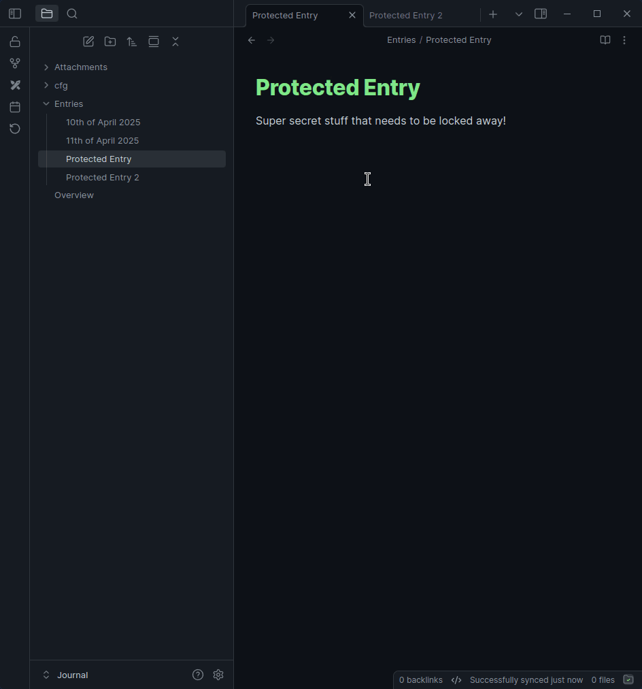
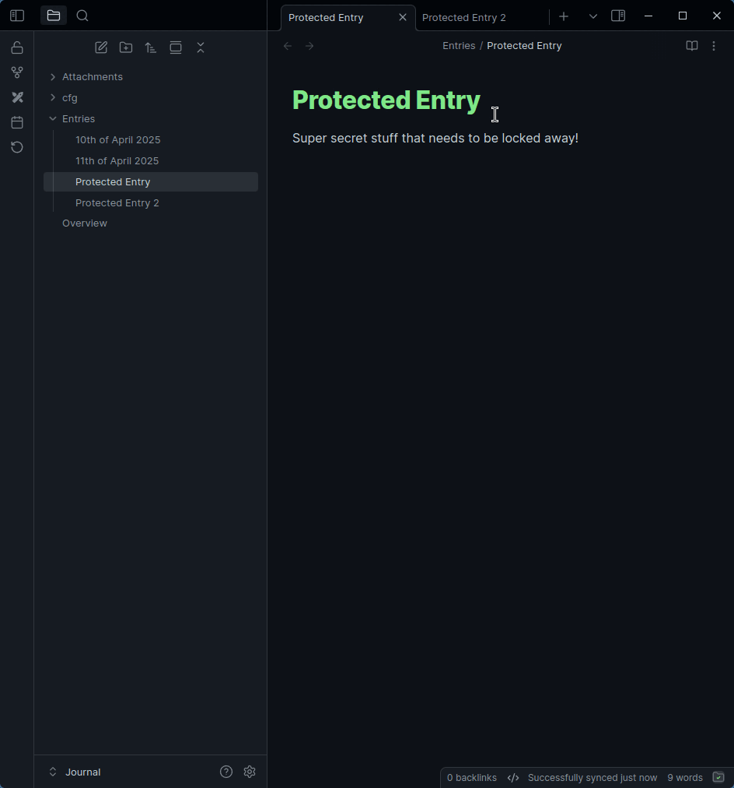

# Simple Password

Protect your [Obsidian](https://obsidian.md) vault with a password

## Features

- Lets you lock your vault so that no one snoops
- Never touches your files
- Auto Lock after inactivity
- Different 'privacy modes': simple blur & closing affected tabs
- You can target specific paths (multiple paths supported)
- Multiple ways to lock: command, hotkeys, ribbon & URL (`obsidian://lock`)
- Protects against page preview core plugin
- Protects against embeds
- Protects against search
- (Optionally) locks graph view
- Allows cancelling, letting a person look through unprotected parts
- Plays well with theming - most things have unique classes

> [!WARNING]
> This plugin **DOES NOT** encrypt files. So if you are looking for *"real"* security, you gotta use some other plugin - like [Protected Note](https://github.com/mmiksaa/obsidian-protected-note) or [Cryptsidian](https://github.com/triumphantomato/cryptsidian)

## How to use, how it works, etc

To set the plugin up, go into the settings and set a password & alter the protected paths as you wish.

After that, the vault has 2 states: locked & unlocked. On load, the state is always locked.

When locked, if you try to open a file or get the preview for a file in a protected path, it will prompt you for a password. If unlocked, it will open the files as normal.

When the privacy mode is set to close tabs, it will not let tabs open for protected files (when locked). After a password is entered, the closed tabs will re-open.

When the privacy mode is set to blur, it will only blur the background of the modal.

### Preview

#### Blur Mode

#### Tab Closer

## Ackgnoledgements

**HEAVILY** inspired by [Qing Li's Password Protection plugin](https://github.com/qing3962/password-protection) - I just wanted to add a few things to their plugin & the codebase didn't allow for my ideas to be easily implemented.
Used the [sample plugin template](https://github.com/obsidianmd/obsidian-sample-plugin)

## Contributing

I'm open to issues, PRs, etc!
